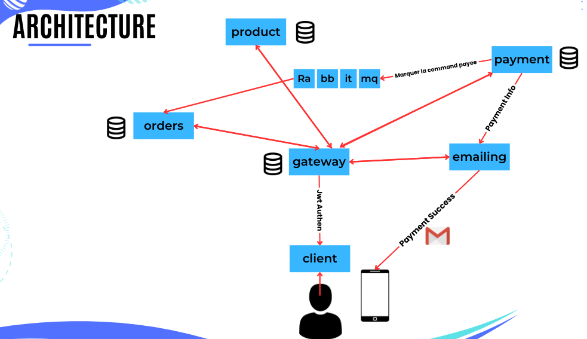
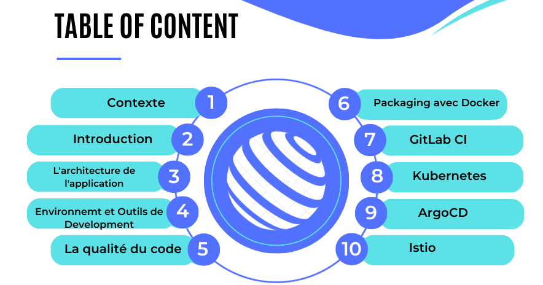

# RAPPORT
Développement et Déploiement d’une Cloud-Native Application e-commerce basée sur les miroservices

# Contexte

KATA est une jeune petite entreprise de développement de solutions et de services logiciels.
Pour les quelques mois à venir, KATA veut saisir une nouvelle opportunité du marché, et
compte se focaliser sur le développement d’une nouvelle solution avec une idée disruptive. Il
s’agit d’une application engageante avec un fort potentiel d’utilisation à l’échelle par des
milliers de clients.
Conscients du manque d’expérience et d’expertise qu’ils ont par rapport au développement de
ce type de projets, ils vous ont recruté afin de réaliser un PoC (Proof of Concept) leur
permettant de découvrir et d’évaluer l’efficacité des concepts, pratiques et technologies Cloud-
Native.
Le sujet de votre mission concerne le développement et le déploiement d’une application
microservices nommée Mcommerce en utilisant les pratiques et technologies cloud-native
(conteneurisation, orchestration des conteneurs, automatisation des déploiements, etc.).
Voir la figure ci-après ainsi que l’annexe (à la fin du document) pour avoir une idée sur les
fonctionnalités proposées par cette application ainsi que la communication entre ces
microservices.

# Travail à réaliser

1. Développer les services backend de l’application Mcommerce en utilisant les
technologies : Node.js / Express ainsi qu’une base de données MongoDB pour le
microservice « produit ».
NB : communication synchrone entre « paiement » et « commande » via une API REST.
2. Développer le frontend de l’application Mcommerce sous forme de SPA (Single Page
Application) avec la librairie React.
NB : communication via API REST entre le frontend et le backend.
3. Créer les fichiers Dockerfile nécessaire pour l’ensemble des services + frontend de
cette application.
4. Automatiser le build, scans de sécurité, packaging et publication de l’image Docker de
chaque service + frontend avec GitLab CI.
5. Créer un répertoire GitLab contenant les fichiers YAML de Kubernetes nécessaires
pour déployer cette application dans un cluster Kubernetes en local.
6. Utiliser l’outil ArgoCD pour détecter les changements au niveau du repo GitLab
contenant les fichiers YAML de K8s afin d’étendre le CI pipeline de GitLab en déployant
chaque microservice mis-à-jour dans le cluster local de Kubernetes.
7. Utiliser le service mesh Istio pour assurer :
a. Stratégie de déploiement (Canary deploys)
b. Observabilité (Visualization, Monitoring, Logging, Tracing)
c. Communication sécurisée entre les services (via mTLS)
d. Circuit Breaking
8. Ajouter un service « email » responsable de l’envoie d’un email de confirmation de
paiement. (Penser à une communication asynchrone entre « paiement » et « email »
via le message broker RabbitMQ).
9. Implémenter la fonctionnalité d’authentification (backend et frontend) pour payer une
commande.
10. Implémenter une API Gateway pour le routage du trafic entre frontend et backend.

# Architecture de l'application

L'architecture qu'on a proposé :

# Tables des matieres

Le plan de notre réalisation du projet:

# Le rapport existe en dessus dans le repository

[Rapport PDF](Presentation_du_rapport_de_project.pdf)

# Liens des repos des services backend et de front end

- [lien vers les repos du code](https://github.com/orgs/E-commerce-microservices-nodejs/repositories)
